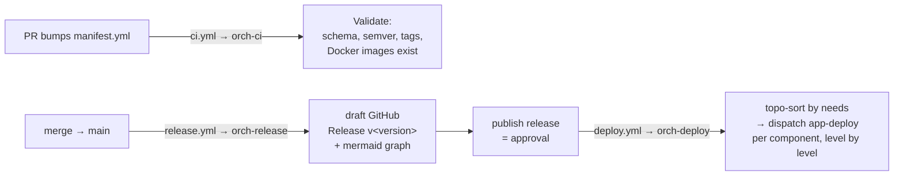

# deploy-manifest

Declarative deploy orchestrator for the progmise APIs — the minimal equivalent
of Gluon/OAM. `manifest.yml` declares a **release**: a version plus the set of
components (repo + tag + dependencies) to deploy together.

## `manifest.yml` schema

```yaml
version: 1.2.0                    # semver — merge to main drafts release v1.2.0
environments:                     # optional — declared deploy targets
  - name: pro
    type: production
    infrastructures:              # infra targets nested under each env (OAM)
      - id: loans-api-pro
        type: vercel              # vercel | artifact-store | ...
        properties:               # free-form provider fields (OAM style)
          project: loans-api      # Vercel project name (literal, non-secret)
          credentialsId: VERCEL_TOKEN      # GitHub secret name in consumer
          orgId: VERCEL_ORG_ID           # GitHub variable name in consumer
          projectId: VERCEL_PROJECT_ID   # GitHub variable name in consumer
components:
  - name: loans-api
    repo: progmise/loans-api
    tag: "0.1.0"                  # git tag + Docker Hub image must exist
    needs: []                     # deploy-after deps (component names)
    infra: [loans-api-pro]        # optional — infra ids this component targets
```

Validation rules (CI): semver `version`, unique env/component names and infra
ids, each `environments[].infrastructures[]` entry has `id` + `type`, `needs` ⊆
component names (acyclic), each `repo:tag` exists, `components[].infra` ⊆ infra
ids. At deploy time the `environment` input must exist in `environments` (when
declared) and a component bound via `infra` fails if none of its targets lives
in that env. Reference naming convention (OAM style): any `*Id` property names
a credential or identifier held in the *consumer repo's* GitHub secrets or
variables — values never live here.

## Flow



1. **PR** that bumps `version` and adjusts `components` → CI validates the
   manifest and renders the deploy plan.
2. **Merge to main** → a *draft* release `v<version>` is created.
3. **Publish the release** to approve it.
4. **Run Deploy** (Actions → Deploy) with `version` + `environment`
   (`pro`/`cert`/`pre` — must be in `vars.DEPLOY_ENVIRONMENTS`). Components
   deploy level by level following `needs`; each repo's `deploy.yml`
   (`app-deploy`) does the actual Vercel deploy.

## Setup

- Secret `ORCHESTRATOR_TOKEN`: PAT (fine-grained) with **Actions: write** on
  every repo listed in `manifest.yml` — needed to dispatch their deploys.
- Var `DEPLOY_ENVIRONMENTS` (JSON, default `["pro"]`), `DOCKER_USERNAME`.
- Optional `GRAFANA_OTLP_ENDPOINT`/`GRAFANA_OTLP_AUTH` for tracing.

See `reusable-workflows/docs/orchestrator.md` for the design.
